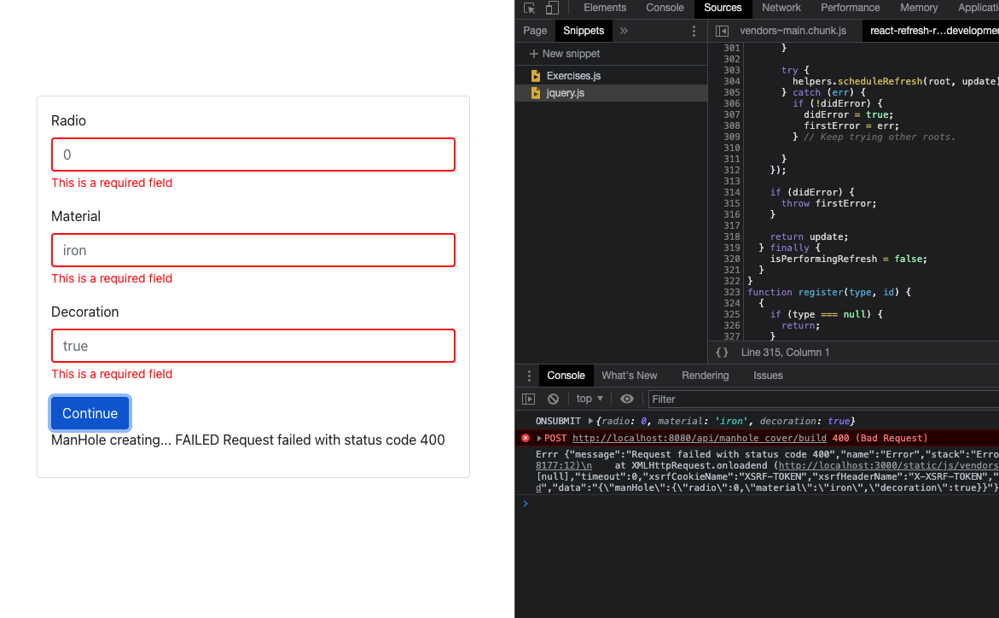
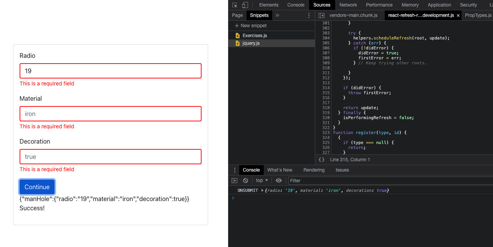
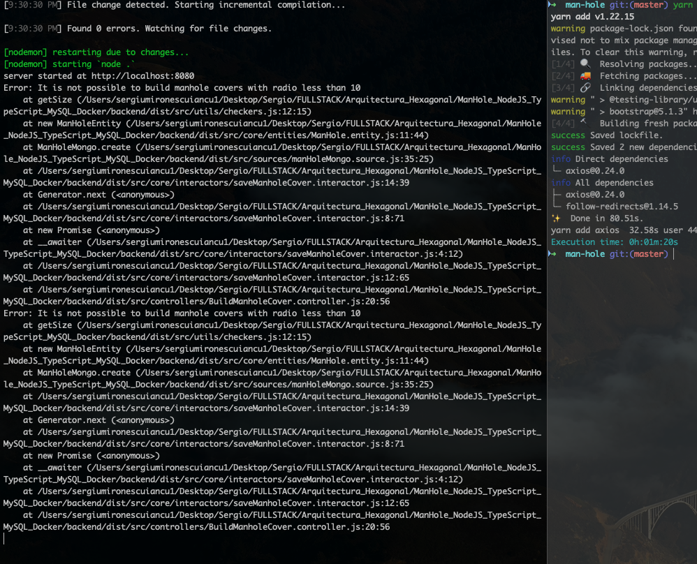

# Getting Started

- Clone the repo git clone: https://github.com/xexiu/ManHole_NodeJS_TypeScript_MySQL_Docker.git

- Install dependencies
`npm install`

- Run mongo and mongoclient
`docker-compose up`

- Add the data located in /mongo to a database called `manHoleApp` (seedDB() in manHoleMongo.source for testing)

- Start typescript server + nodemon
`npm run watch`

## Available Scripts (front-end)

In the project directory, you can run:

### `yarn start`

Runs the app in the development mode.\
Open [http://localhost:3000](http://localhost:3000) to view it in the browser.

The page will reload if you make edits.\
You will also see any lint errors in the console.

### `yarn test`

Launches the test runner in the interactive watch mode.\
See the section about [running tests](https://facebook.github.io/create-react-app/docs/running-tests) for more information.

### `yarn build`

Builds the app for production to the `build` folder.\
It correctly bundles React in production mode and optimizes the build for the best performance.

The build is minified and the filenames include the hashes.\
Your app is ready to be deployed!

## Some Screenshots

